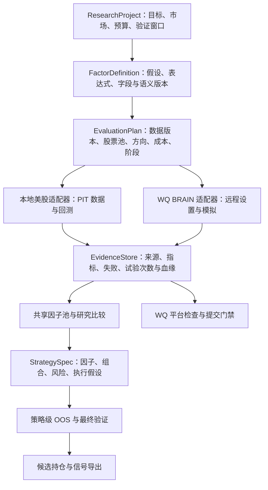

**QuantGPT 项目审阅：美股因子研究、策略转换、工具效率与体验**

审阅日期：2026-10-05（Asia/Shanghai）。基线：`main / 25bda5e`。目标：本地美股研究和 WQ BRAIN 两条路线同时发展，优先打通共享研究流程。

**结论：保留现有架构并分阶段改造是合理路径，但当前版本还不是完整、可信的美股因子到策略平台。** 它已经具备表达式、分组回测、实验账本、因子池、StrategySpec、WQ 远程接口和前端工作台；主要缺口在真实美股数据、数值正确性、研究证据的一致性和跨入口闭环。优先修正这些基础，再扩大自动挖掘规模、增加优化器或启用更多 Rust 加速。

本报告区分三类内容：合成数据已复现的错误、源码明确显示的契约/能力缺口、待实施的设计建议。README 展示的历史收益与 BRAIN 提交记录没有进行独立账户核验，不能用它们证明当前本地引擎或美股策略有效。本次没有运行真实账户操作、提交因子、访问付费行情或修改产品实现。

**1. 当前能力与目标的差距**

| 环节 | 当前实际能力 | 距离目标的主要差距 |
|---|---|---|
| 本地行情 | A 股行情、单股 Parquet、缓存检查、受控远程补数 | 无真实美股 StrategyAdapter；交易日历、证券身份、公司行动、退市和历史成员未成体系 |
| WQ BRAIN | USA 等远程模拟、批量参数扫描、检查、提交前门禁与 override 记录 | 远程研究和本地策略不共享完整实验身份；本地代理指标不可当远程平台结果 |
| 因子分析 | 表达式、IC/Rank IC、分组、方向、换手、局部反过拟合/rolling、OOS | 有前视、行错位、跨股计算、经济字段替代问题；统计和容量分析不完整 |
| 策略构造 | 多因子、方向、Top-N/分位组、等权/分数权重、个股上限、换手限制 | 主要为日频 long-only；没有真实美股估值/执行契约、完整风险优化和基准分析 |
| 策略回测 | 目标权重、成本、收益、OOS、报告和持仓 | 资金核算、费用、缺失行情处理不可靠；策略 IC 与 OOS 口径不一致 |
| 研究治理 | experiment ledger、snapshot、搜索尝试、promotion | 快照未覆盖实际全部输入；策略没有独立完整证据闭环；最终测试集未统一锁定 |
| 工具 | 49 个 MCP 工具、REST、因子异步任务及取消 | 同一研究多次读数/回测；MCP 策略缺任务式异步，HTTP 策略状态机不完整；任务恢复与状态转换不一致 |
| 浏览器 | 因子、组合、策略、WQ、任务中心、报告 | MCP 池与网页库分离；研究日期隐含固定；优化/导出路径有断点 |

真实美股尚未接入的依据：[行情股票池](E:/fpga/量化gpt/quantgpt/market_data.py:257)、[A 股策略适配器](E:/fpga/量化gpt/quantgpt/strategy/a_share_adapter.py:64)、[合成 global demo](E:/fpga/量化gpt/quantgpt/strategy/demo_global_adapter.py:58)。provider registry 中 `fetch_*` 是 unavailable 占位接口，不等于所有已有 A 股 fetch 都不可用，参见 [provider registry](E:/fpga/量化gpt/quantgpt/market_data_providers.py:77)。WQ 的 USA 远程模拟入口见 [wq_brain_client.py](E:/fpga/量化gpt/quantgpt/wq_brain_client.py:118)。

**2. 必须优先修正的正确性问题**

P1 表示会改变研究结论或阻断核心流程，应在把结果作为可信候选之前修复；P2 表示指标、复现、可靠性或效率方面的重要改进。这里的优先级不是仓库已经存在的任务编号。

| 编号 | 优先级及证据 | 问题、影响和修复方向 |
|---|---|---|
| C01 | P1，已数值复现；[scale](E:/fpga/量化gpt/quantgpt/expression_parser.py:313) | `scale` 使用全样本 min/max。单股 close `[10,20]` 得 `[0,1]`，追加未来 40 后历史值变 `[0,1/3]`。这会污染组合因子/阈值。定义逐日截面或仅过去窗口的缩放，并版本化语义。 |
| C02 | P1，已数值复现；[中性化写回](E:/fpga/量化gpt/quantgpt/neutralize.py:119) | 按日期 groupby 后直接 `.values` 写回按股票排列的表。输入 `[1,2,3,4]` 变 `[1,3,2,4]`，信号落到错误股票/日期。按原始索引对齐，禁止丢失行身份。 |
| C03 | P1，已数值复现；[布林带](E:/fpga/量化gpt/quantgpt/expression_parser.py:703) | Python 布林带直接 rolling，跨股票串值。A `[10,20]`、B `[30,40]` 的两日均值是 `[10,15,25,35]`，B 首日应为 30。所有时序算子必须按证券隔离。 |
| C04 | P1，源码交叉核对；[Rust rank](E:/fpga/量化gpt/engine/src/expression/eval.rs:150) | Python/Rust 排名归一化及 ties 处理不同；三个同值在 Python 为同一排名，Rust 可分成 0/0.5/1。安装加速库会改变因子含义。先做逐值差分测试，再按算子白名单启用加速。 |
| C05 | P1，源码及 `cap` 复现；[市值中性化](E:/fpga/量化gpt/quantgpt/neutralize.py:125) | 把 `close*volume` 当市值；`cap` 缺股数时甚至退化为 close。成交额、价格、市值是不同经济变量。缺真实市值应显式失败或使用独立命名的代理字段。 |
| C06 | P1，源码确认；[财务字段映射](E:/fpga/量化gpt/quantgpt/fundamental_data.py:672) | 财务 fallback 将总股本映射为总权益、权益增长映射为 EPS 增长、资产增长映射为营收增长等。同名表达式换供应商后含义改变。建立单位/周期/分子分母/可用时刻的字段契约，只允许等价映射。 |
| C07 | P1，已数值复现；[持仓收益](E:/fpga/量化gpt/quantgpt/strategy/backtest.py:518) | 非调仓日仍用固定目标权重，隐含免费每日调仓。A/B 初始各半，A `100→200→100`、B 不变，真实持有收益 0%，系统为 **+12.5%**。以数量、现金、NAV 记账，调仓按实际仓位计算交易。 |
| C08 | P1，原函数路径数值复现；[组成本](E:/fpga/量化gpt/quantgpt/backtest.py:301)、[多空相减](E:/fpga/量化gpt/quantgpt/backtest.py:344) | 先给上下组分别扣成本，再 `net_top-net_bottom`，把空头侧成本加回来。恒定价格、频繁换组、1% 费用时单组持续亏损，多空仍为 0。应为毛多空收益减两边成本，并声明 gross exposure 口径。此问题不说明远程 BRAIN 也有错误。 |
| C09 | P1，已数值复现；[缺失率](E:/fpga/量化gpt/quantgpt/data_quality.py:246)、[先过滤后切 OOS](E:/fpga/量化gpt/quantgpt/strategy/backtest.py:92) | 根据整个请求区间的缺失率删除整只股票，测试期的缺数能反向改变训练股票池。改为当时已知的可交易资格与历史窗口；全样本质量报告不得追溯修改过去资格。 |
| C10 | P1，数值/源码确认；[复合因子填零](E:/fpga/量化gpt/quantgpt/strategy/backtest.py:490) | 所有因子 NaN 时复合值变 0，Top-N 按股票代码破平局并买入。`min_history_days` 有配置但未强制执行。保留 missing mask、最低覆盖率和 warmup；没有有效信号不得新建仓位。 |
| C11 | P1/P2，数值/源码确认；[信号删行](E:/fpga/量化gpt/quantgpt/strategy/backtest.py:147)、[缺行情记零](E:/fpga/量化gpt/quantgpt/strategy/backtest.py:523) | 信号表同时承担估值，删去缺因子行后持仓股票的当日回报可能被默认置零。分开信号、可交易性与估值表；停牌、退市、缺价必须有显式处理。 |
| C12 | P2，已数值复现；[回撤](E:/fpga/量化gpt/quantgpt/backtest.py:514)、[首笔换手](E:/fpga/量化gpt/quantgpt/strategy/risk.py:74) | `[-10%,0]` 的最大回撤返回 0；首笔建仓 turnover=0 因而不收费。净值以前置 1 起算，按实际买卖金额收费，明确现金与初始持仓。 |
| C13 | P2，已数值复现；[调仓锚点](E:/fpga/量化gpt/quantgpt/backtest.py:88) | 同一 anchor 改变回测截窗后，调仓日期不再是全窗子集；偏移计算方向有误，且工作日并非交易日。先用市场交易会话生成唯一调仓日序列，再切窗口。 |
| C14 | P2，已数值复现；[多因子 IC](E:/fpga/量化gpt/quantgpt/strategy/backtest.py:494) | 普通策略 IC 使用第一个原始因子；OOS 使用复合信号。仅交换因子顺序即可改变同一组合的 IC 输入。统一复合信号 IC，分开展示原始/方向调整后的单因子 IC。 |
| C15 | P2，已数值复现；[warmup](E:/fpga/量化gpt/quantgpt/validation/split.py:72) | 嵌套 `ts_mean(ts_mean(close,20),60)` 推断 20 天，完整窗口需要 79 条观测。应从 AST 自底向上推导依赖，不靠正则最大数字。 |

这些错误互相独立。即使某个简单 rank-only 因子恰好不受 `scale` 问题影响，也不能推广到组合表达式、阈值规则或其他算子。优先加入经济不变量测试，而不是仅验证返回 JSON 有某字段。

**3. 数据与研究证据还需要补齐什么**

- **历史股票池。** A 股策略当前拿 start_date 一次名单回放全程；factor_values 默认 end_date 名单。需要 `security_id + valid_from + valid_to` 的历史成员表，明确固定 cohort 和动态 universe；月度缓存不能代表月内的真实生效日。美股不能以今天的 S&P 500 名单回测过去，再称无幸存者偏差。见 [a_share_adapter](E:/fpga/量化gpt/quantgpt/strategy/a_share_adapter.py:64)、[factor_values](E:/fpga/量化gpt/quantgpt/factor_values.py:75)。
- **PIT 财务版本。** 当前有公告日 backward join，这是有价值的基础；但 `(stock_code,stat_date)` 去重会覆盖旧财报版本，日期粒度也缺公布时刻。需保留 period_end、published/accepted_at、revision_id、available_at、fetched_at，按决策时刻选择版本。见 [财务去重](E:/fpga/量化gpt/quantgpt/fundamental_data.py:255)、[财务对齐](E:/fpga/量化gpt/quantgpt/fundamental_data.py:390)。
- **复权与公司行动。** 旧前复权缓存和新抓取区间直接拼接，存在复权基准不同的风险；这是源码识别出的风险，未用真实拆股事件复现。保存 raw OHLCV、split/dividend 因子和 total-return 口径；市值、股数、价格和 VWAP 必须兼容。见 [缓存拼接](E:/fpga/量化gpt/quantgpt/market_data.py:710)。
- **数据快照覆盖不足。** snapshot hash 仅覆盖基础 OHLCV；同一 schema 下把 suspended 从 false 改为 true，ID 不变。财务 enrich 前已生成 provenance。改为所有实际输入的 manifest/hash，包括财务 vintage、行业、股数、成员资格、价格/公司行动和引擎版本，并保存可重新读取的数据。见 [hash 字段](E:/fpga/量化gpt/quantgpt/data_snapshots.py:18)、[hash 实现](E:/fpga/量化gpt/quantgpt/data_snapshots.py:248)。
- **最终测试集和搜索次数。** 因子已有 selection/final 分离，策略每次 OOS 却计算完整 train/valid/test。multiple_testing/similarity 仅在传入时检查，未列入强制晋级项；PSR/DSR 错误码不等于实现了算法。需要研究项目级冻结配置、试验登记、final 解锁记录。多重测试参数应来自账本，不能由调用者随意填次数。见 [策略 OOS](E:/fpga/量化gpt/quantgpt/strategy/backtest.py:297)、[晋级要求](E:/fpga/量化gpt/quantgpt/validation/promotion.py:24)。
- **证据要绑定对象。** `promote_experiment` 接收调用者提供的 provenance 并评估布尔检查，没有在此路径按 experiment/spec/snapshot 核实证据归属。建议只传 evaluation_id，由服务读取证据、核实哈希和 scope；不是要求用户或 LLM 手工拼通过标记。见 [promote_experiment](E:/fpga/量化gpt/quantgpt/mcp_server.py:2399)。

策略 `anti_overfit` 当前主要是收益、回撤、换手、日志条数阈值；策略 `rolling` 是对已经生成的收益分段，并非逐窗训练/选择/冻结后测试。应如实命名为“收益健康检查”“分段稳定性”，并另建真正 walk-forward 验证。参见 [strategy/validation.py](E:/fpga/量化gpt/quantgpt/strategy/validation.py:14)。

**4. 双路线共享的研究架构**

建议保留现有服务和适配器，在统一研究身份及证据契约下改造，避免整体重写。

| 对象 | 应保存什么 | 与当前结构的衔接 |
|---|---|---|
| ResearchProject | owner/workspace、目标市场、时区、验证窗口、预算和搜索族 | 给 MCP/REST/Web 共同可见的研究身份 |
| FactorDefinition | hypothesis、AST、语义版本、字段依赖、方向和来源 | 连接 FactorRegistry 与 FactorPoolEntry；收藏作为视图 |
| EvaluationRun | backend、完整 config hash、snapshot、代码版本、种子、状态、试验族 | 扩展现有 Experiment，而非重复新建多套账本 |
| EvidenceArtifact | IC/收益/暴露/成本、可追溯产物、失败及适用 scope | 与已有 ExperimentResult/Artifact 统一 |
| StrategyDefinition/Run | 完整 spec hash、所有因子版本、构造/执行假设、验证证据 | 复用 Strategy/StrategyRun，补闭环 |

**可共享的是研究假设、因子定义、血缘、状态和证据格式；执行口径必须明确。** BRAIN 的 USA/TOP3000、delay、decay、neutralization、truncation 不自动等价于本地相似名称。WQ-only 字段要显示 remote-only；本地不可得时不能用 A 股或代理字段冒充。BRAIN 远程成绩、本地美股成绩、本地 WQ 近似指标应分栏展示，并标注可比性。已有 scope mismatch 门禁方向正确，应继续保留。

**5. 美股数据应按研究需求逐层接入**

建议第一版聚焦日频美股普通股，先做 long-only/long-cash 可审计研究组合，再扩展带完整借券成本的多空组合。ETF、ADR、OTC、优先股、REIT 是否纳入都应在 universe 规则中明确。

| 数据层 | 最小要求 | 主要服务的因子 |
|---|---|---|
| SecurityMaster/Calendar | 稳定证券 ID、ticker 历史、上市/退市、NYSE/Nasdaq 会话、纽约时区/夏令时 | 全部研究的基础 |
| 行情/公司行动 | raw OHLCV、明确 feed、拆股、分红、total-return、停牌、真实交易状态 | 动量、反转、波动率、流动性、价量 |
| PIT 基本面 | 公告/可用时刻、修订 vintage、币种、股数、行业历史 | 价值、盈利质量、杠杆、成长、投资/应计 |
| 风险与约束 | 行业/size/beta、ADV、价差/冲击模型、借券可得性和费用 | 中性化、组合风险、成本/容量 |
| 扩展数据 | 有授权且保留历史时点的预期、新闻、期权、事件 | 预期修正、情绪、事件与期权因子 |

可评估两种数据方案，先用相同样本做质量验收再决定供应商：

- 较轻方案：行情 provider 加 SEC 财务。SEC 官方 API 提供 submissions 与 XBRL companyfacts，但报告版本选择、字段标准化及 PIT join 仍需本项目实现。来源：[SEC EDGAR API](https://www.sec.gov/search-filings/edgar-application-programming-interfaces)。
- 更完整方案：评估有 active/delisted 和 as-reported/PIT 维度的商业数据，如 Sharadar，并验证覆盖、许可和公司行动的一致性，不把供应商宣传直接当验收结果。来源：[Nasdaq Data Link SF1](https://data.nasdaq.com/databases/SF1/documentation)、[SEP](https://data.nasdaq.com/databases/SEP/documentation)。
- 若选 Alpaca 行情，必须固定 `feed`、`adjustment`、`asof`，逐页读取；IEX 是单一交易所、SIP 是合并行情，成交量/VWAP 因子不可无标记地混用。来源：[Market Data FAQ](https://docs.alpaca.markets/us/docs/market-data-faq)、[Historical bars](https://docs.alpaca.markets/us/reference/stockbars)。

本次没有采购数据或决定付费供应商。上述是接入候选及验收依据，不是收益承诺。PIT universe 的必要性亦可参照 [QuantConnect Research Guide](https://www.quantconnect.com/docs/v2/writing-algorithms/key-concepts/research-guide)。

**6. “完整分析一个因子”应输出什么**

每个因子生成一张能追溯到数据和实验的研究卡，不只给综合评分：

| 维度 | 必备输出 |
|---|---|
| 经济逻辑与数据 | 假设、预期方向、适用股票、字段单位、可用时点、覆盖率与缺失分布 |
| 算子与时序 | AST、lookback、warmup、异常值/缺失规则、行业/规模中性化前后、未来不变性 |
| 预测效果 | 预先指定 1/5/20/60 日等 horizon 的 IC/Rank IC、分布、衰减、置信区间；处理重叠收益的依赖 |
| 可投资效果 | 分组单调性、毛/净收益、上下组及多空两侧、换手、drawdown、交易成本敏感性 |
| 风险解释 | 行业、size、beta、波动、流动性暴露；是否只是在复制已有风险溢价 |
| 增量价值 | 与库内因子值和收益的相关性、残差 IC、加入已有组合的样本外增量；不是只看表达式相似度 |
| 稳健性 | 子时期/行业/规模分层、walk-forward、参数邻域、延迟一天、成本提高、数据版本变化 |
| 统计治理 | 总试验与同族试验次数、预注册筛选、FDR/DSR 等适当检验、最终测试解锁记录 |
| 结论 | accepted/watchlist/rejected/insufficient_data 的原因、适用 scope、下一步实验、可否进入策略 |

不应预设一个通用的“Sharpe/IC 超过某数就合格”。阈值和样本长度、持有期、市场/股票池、费用及研究目标有关。LLM 可以提出经济解释和实验，但判断必须落在可复核统计与数据上；第二个 LLM 的同意不能替代独立样本验证。

**7. 因子转换为策略的具体路径**

1. 从同一研究 scope 中选择候选，先剔除高度重复信号；保留因子方向、版本、缺失规则和验证证据。
2. 先建立可解释基线：截面标准化后的因子等权组合，明确可用时点和调仓频率。后续权重优化须证明相对基线的样本外增量。
3. 将复合分数转换为资产选择与目标权重；应用个股、行业、beta、现金、ADV/交易量和换手限制。
4. 明确 `signal_time → executable_time → fill_price`。如果用收盘后完整数据生成信号，就不能默认能以同一收盘价成交；应建次日开盘或其他明确成交模型。
5. 用完整持仓账本核算成本、现金、分红、拆股、缺价与退市，和适合该 universe 的 total-return 基准比较。当前 benchmark 主要被记录，策略执行未调用 adapter 的 benchmark returns，需接通。
6. 对完整策略重新验证：因子各自通过不等于组合策略通过；所有因子、权重、规则、成本一起构成 spec hash。
7. 输出候选持仓、调仓信号、风险报告和适用期。现有仓库定位是研究候选导出，真实券商执行并未实现，不能把这些输出描述为已经具备实盘能力。

当前 `optimize_candidate_weights` 实际是正分数归一化后施加风险规则，不是协方差或交易成本优化器，见 [optimizer](E:/fpga/量化gpt/quantgpt/strategy/optimizer.py:24)。后续可按以下顺序增强：

- 先做去相关/聚类后的等权基线、权重收缩和稳定性对比。
- 再估计风险协方差，优化“预测收益 − 风险惩罚 − 交易成本 − 换手惩罚”；参数只在训练/验证区间选择。
- 约束包括权重总和/现金、个股、行业、beta、ADV、gross/net exposure；short 只有在借券/费用数据和回测机制都具备时开放。
- 用滚动训练和参数邻域检验取代大范围暴力搜索；记录全部尝试，锁定最终测试。也可以保留 Pareto 候选，而不是一个混合评分选出唯一冠军。

**8. 工具与界面的核心断点**

| 问题 | 源码依据 | 建议 |
|---|---|---|
| 策略回测固定 2024-01-02 至 03-29、hs300；UI 无请求级日期输入 | [StrategyWorkbench](E:/fpga/量化gpt/frontend/src/components/StrategyWorkbench.tsx:38) | 显示可编辑研究上下文；市场、股票池、基准、时区、数据覆盖联动；OOS 提交前校验窗口长度 |
| 正常优化按钮发送 target_weights，但后端要求 score | [StrategyDiagnosticsPanel](E:/fpga/量化gpt/frontend/src/components/strategy/StrategyDiagnosticsPanel.tsx:34)、[optimizer](E:/fpga/量化gpt/quantgpt/strategy/optimizer.py:16) | 传带评分的 signal artifact/ref；结果展示权重差异并触发重验 |
| 策略回测未生成 experiment_id、factor_hash、validation_provenance，导出却强制要求；已有数据来源和快照字段 | [service 回测](E:/fpga/量化gpt/quantgpt/strategy/service.py:56)、[service 导出](E:/fpga/量化gpt/quantgpt/strategy/service.py:88) | 后端创建策略实验及验证证据；前端按状态展示缺失步骤；不能让 LLM 补写通过字段 |
| MCP 因子池与网页收藏是两个表，所有者也不同 | [MCP owner](E:/fpga/量化gpt/quantgpt/mcp_server.py:2500)、[Web 旧库](E:/fpga/量化gpt/frontend/src/api/factorLibrary.ts:46) | 统一项目/owner 和因子库，按收藏、accepted、watchlist 等提供视图；“加入策略”携带版本和证据 |
| HTTP 策略取消会被 completed 覆盖 | [策略任务](E:/fpga/量化gpt/quantgpt/routes/strategy.py:374) | 统一取消 token 和终态转换；不能在取消后继续报告成功。已用原任务函数隔离复现 |
| MCP 策略回测无 submit_only/task_id/进度/取消 | [MCP 策略回测](E:/fpga/量化gpt/quantgpt/mcp_server.py:1018) | 因子、策略、WQ 统一 submit/get/cancel/result 生命周期 |
| MCP 查任务只查内存，重启/清理后无法取已持久化结果 | [mcp_task_helper](E:/fpga/量化gpt/quantgpt/mcp_task_helper.py:161) | 提交即落库，查询走共享 DB fallback，重启任务标记 interrupted/retryable |
| SSE 不推送同阶段进度增量 | [backtest_tasks](E:/fpga/量化gpt/quantgpt/routes/backtest_tasks.py:1118) | 用 task revision/event cursor；支持断线续读，显示阶段、已完成数量和等待原因 |

主界面建议围绕五步组织：**研究上下文 → 因子库/比较 → 策略构造 → 验证 → 候选导出或 WQ 检查**。顶部一直显示真实市场、数据源/快照、研究日期、基准、可用字段和执行后端。结果页优先展示净收益、基准、回撤、换手、成本、持仓与暴露，再给高级 JSON。demo/remote-only/unavailable 应可见，避免“语法能解析”被理解为“数据可得且能执行”。

**9. 提升工具效率：先减少重复计算，再扩大并发**

已存在的有价值机制：因子 MCP 默认 cache-only、远程预取规划、单股缓存诊断、submit_only、协作取消、ProcessPool/Thread/Celery 执行器。这些应复用，不能为了新工作流再做一套状态机。

| 改进 | 当前浪费/风险 | 目标和验收方式 |
|---|---|---|
| 统一 `evaluate_factor` 入口 | backtest/score/anti/rolling 各读行情并再次回测；部分仅为了取得 factor_df | 一次创建 snapshot/panel，按阶段生成产物；后续评分/诊断/报告使用 evaluation_id |
| 分层不可变缓存 | 单股 Parquet 有缓存，但任务仍逐股读，并把整表传给每个 CPU 任务 | panel、AST、公共子表达式、因子值、回测和报告分层；记录读取量、IPC 时间、命中率；使用内存预算和淘汰策略 |
| 完整缓存键 | expression-only 不能区分数据/市场/方向/费用 | key 覆盖全部输入 manifest、字段/算子/引擎版本、PIT、universe、窗口、方向、中性化及执行假设；语义不同不得复用 |
| 批量计划与幂等 | 超时重试可能重复 POST，缓存补数和 CPU 任务混在一起 | plan 显示缺数据量/资源预算；共享一次 prewarm；idempotency_key 和批量状态；数据源限流与计算并发分别管理 |
| 摘要返回和分页 | 大量 JSON 占用 LLM 上下文；部分列表先全量取出再 Python 分页 | 默认返回状态、关键指标、blockers、artifact_ref；详情/曲线按需取；DB cursor 分页 |
| 指标与报告解耦 | 非 OOS score_factor 为取 metrics 先生成 HTML | 指标直接计算，报告按需渲染；同一结果重复下载不重新回测 |
| 任务可靠性 | 生命周期不一致，超时、取消和重启难恢复 | 统一 deadline、并发配额、背压、checkpoint、终态保护、错误码和下一步提示 |
| Rust 渐进启用 | 当前语义不一致，快了但答案可能不同 | Python 为基准做差分测试；先启用语义一致且 profile 显示值得优化的核 |

重复计算位置可核对 [run_backtest](E:/fpga/量化gpt/quantgpt/mcp_server.py:1511)、[score_factor](E:/fpga/量化gpt/quantgpt/mcp_server.py:1964)、[anti_overfit](E:/fpga/量化gpt/quantgpt/mcp_server.py:2951)、[rolling](E:/fpga/量化gpt/quantgpt/mcp_server.py:3202)。它们方向与 OOS 语义并不完全相同，优化应共享恰当层级，不能直接复用最终结果。

建议后续建立固定性能基准：例如 500 股、10 年日线、20 个表达式，分别测冷缓存/暖缓存的耗时、内存、数据请求、取消响应、重跑命中率和返回 JSON 大小。本次没有跑真实大股票池基准，因此不承诺具体加速倍数。第一验收目标是一个 batch 只构建一次共享数据面板、摘要可从已完成实验直接读出。

**10. 建议实施顺序与验收**

| 阶段 | 工作包 | 完成标准 |
|---|---|---|
| A：可信计算 | C01–C15、字段契约、完整估值表、资金账 | 未来追加不改变历史信号；股票行重排不改变因子；零毛收益只能因成本亏损；固定信号、成交和持仓路径下增加费用不能提高净多空收益；无信号不建仓；Python/Rust 一致 |
| B：共享研究闭环 | 项目身份、统一因子池、EvaluationRun、证据绑定、final 锁 | MCP 创建的因子网页可见；无需手工补 JSON 即可完成因子→策略→验证→合法候选导出；WQ 与本地证据不可串用 |
| C：真实美股最小闭环 | US adapter、证券主表、日历、公司行动、PIT universe、基准、核心财务 | 拆股/分红/改名/退市/夏令时样本通过；历史资格与财报版本可重放；真实美股价格及财务因子各跑通一条研究链 |
| D：策略研究质量 | 复合因子 IC、风险暴露、成本/容量、真实 walk-forward、试验校正 | 相同策略的各入口指标一致；最终测试不参与挑选；与等权/单因子/基准对照并可解释净收益来源 |
| E：工具效率与体验 | 统一异步、缓存/批量/幂等、断线恢复、交互修复、结果对比 | 取消不复活、重启可查、重试不重复、同阶段进度可见；研究日期可编辑；优化与导出端到端用例通过 |
| F：进一步优化 | 风险/交易成本优化器、扩展数据、经过验证的 Rust 核 | 在相同数据和验证预算下获得可重复的样本外增量；性能改善有基准记录 |

A、B 中部分 UI/任务修复可以并行，但扩大美股自动搜索规模应以可信计算和证据闭环为前提。数据合同与 SecurityMaster 可提前设计。无需一次实现所有因子类别；先以少量价量和基本面因子贯穿整个闭环，再扩展覆盖。

**11. 验证记录与本次交付范围**

本机为 Windows、Python 3.14.3；仓库 CI 配置使用 Ubuntu、Python 3.12。本次在项目 `.venv` 和 `frontend/node_modules` 中安装依赖，未更改系统 Python、产品实现或依赖声明。前端按现有 package-lock 安装；Python 的宽松下限会解析到审阅当日的新版本，因此以下结果不能等同于原维护者环境的 CI 结果。

干净安装存在确定的兼容性缺口：[pyproject.toml](E:/fpga/量化gpt/pyproject.toml:12) 的 `mcp>=1.0` 允许 MCP 2.x，而 [mcp_server.py](E:/fpga/量化gpt/quantgpt/mcp_server.py:26) 仍导入 `mcp.server.fastmcp.FastMCP`。实际安装 MCP 2.3.0 后，pytest 收集阶段出现 7 个导入错误。随后只在隔离环境将 MCP 限定为 `<2`（得到 1.30.0）继续验证。应在项目中确定支持的主版本并生成受测试的锁文件，或完成明确的升级迁移；不能依赖安装时碰巧取得旧版。

Rust `cargo test` 已下载依赖并尝试构建，但 `pyo3-ffi 0.24.2` 明确拒绝本机 Python 3.14，提示其最大支持版本为 3.13。没有绕过兼容检查，因此 Rust 测试未运行。这是环境/支持矩阵问题，不是已经证实 Rust 单元测试失败。建议将 Python、PyO3、numpy/pandas 和 MCP 的支持矩阵列入 CI，补 Windows 安装验证及 PowerShell 启动说明。

| 检查 | 结果及证据 |
|---|---|
| 合成数值复现 | 保存脚本覆盖 8 项，全部重现问题：scale 前视、中性化错位、布林带跨股、快照漏可交易性、锚点不一致、首日回撤、持仓漂移、首笔不收费。见 [JSON 结果](E:/fpga/量化gpt/docs/reviews/numerical-reproductions-20261005.json) |
| 前端 `npm ci` / `npm run build` | 通过 TypeScript 和 Vite 构建；主 JS 834.69 kB（gzip 234.70 kB），有大 chunk 警告。可按工作区延迟加载图表/报告模块；尚未做浏览器端到端操作验证 |
| 首次 `pytest tests -q --tb=short` | MCP 2.x 不兼容，7 个 collection errors；[原始日志](E:/fpga/量化gpt/docs/reviews/pytest-20261005.txt) |
| 兼容 MCP 环境完整测试 | **693 passed、1 failed、17 warnings，108.83 秒**。唯一失败是 Windows 路径使用反斜杠，而测试用 `endswith("stocks/sh_600487.parquet")`；不是已证实行情功能错误。见 [完整日志](E:/fpga/量化gpt/docs/reviews/pytest-mcp1-20261005.txt)、[失败断言](E:/fpga/量化gpt/tests/test_mcp_stock_history.py:61) |
| `ruff check quantgpt tests` | 1 个已有 import 排序问题，位于 tests/test_fundamental_data.py:3；[日志](E:/fpga/量化gpt/docs/reviews/ruff-20261005.txt) |
| 显式指定 `.venv` 的 Pyright | 436 errors；这是当前依赖组合下的静态诊断，不能当成 436 个已复现运行时错误；[日志](E:/fpga/量化gpt/docs/reviews/pyright-mcp1-20261005.txt) |
| `cargo test` | 在 Python/PyO3 版本兼容检查阶段阻断，未执行 Rust 测试 |

独立数值复现脚本：[reproduce_20261005.py](E:/fpga/量化gpt/docs/reviews/reproduce_20261005.py)。它用合成输入调用原函数，部分通过 AST 隔离无关服务依赖；不是对外部行情或 BRAIN 平台的实测。脚本覆盖上述 8 项，其余表中标注数值复现的项目来自此次审阅的独立临时检查，并未全部收录进同一脚本。运行命令为 `.\.venv\Scripts\python.exe docs/reviews/reproduce_20261005.py`。

现有测试大部分通过，仍未覆盖本报告复现的资金核算和时序不变量，所以不能据此推断研究结果已经可靠。本次未对真实美股大规模数据性能、BRAIN 实际成绩或浏览器交互进行实测。

环境记录保留为 [初次安装](E:/fpga/量化gpt/docs/reviews/environment-20261005.txt) 和 [MCP 兼容调整后](E:/fpga/量化gpt/docs/reviews/environment-mcp1-20261005.txt)，用于解释验证边界和重现检查。

本次交付是审阅报告与复现材料。产品源代码未修补；任何后续真实美股绩效结论，都应在修复后的引擎、明确的数据版本和独立测试窗口上重新产生。
